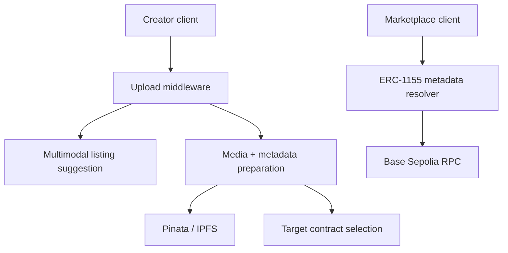

# Realife backend

Media preparation, multimodal listing assistance, IPFS metadata generation, and
read-only ERC-1155 metadata resolution for [Realife](https://realife.live).

This repository is one part of the public Realife MVP. The main marketplace,
semantic index, natural-language search, order assistant, database schema, and
wallet UI live in
[`BornUkraine/realife-frontend`](https://github.com/BornUkraine/realife-frontend).

> **Status:** experimental software running against Base Sepolia testnet. It has
> not received an independent security audit. Do not use it to control mainnet
> funds.

## What this service does

- Accepts an image or video and asks a multimodal model for structured listing
  fields such as category, fulfillment type, title, description, and search
  tags.
- Extracts a video poster with `ffmpeg` when the client does not provide one.
- Pins media and ERC-1155-compatible JSON metadata through Pinata.
- Selects the standard or protected testnet mint flow from fulfillment data.
- Resolves ERC-1155 metadata from configured contracts using read-only Base
  Sepolia RPC calls.

The service does **not** hold seller keys, sign mint transactions, release
escrow, or decide disputes. Wallet signatures and protected transaction state
belong to the client and on-chain flow.

## API

| Method | Path | Purpose |
| --- | --- | --- |
| `GET` | `/` | Health, model, RPC, and configured-contract summary |
| `POST` | `/api/ai-suggest` | Multimodal listing suggestion from an uploaded image/video |
| `POST` | `/api/mint/prepare` | Pin media and metadata, then return the target mint contract |
| `GET` | `/metadata1155/:tokenId` | Resolve metadata across configured ERC-1155 contracts |
| `GET` | `/metadata1155/:contract/:tokenId` | Resolve metadata for an explicit ERC-1155 contract |

Both POST endpoints use multipart form data. The implementation and accepted
fields are inspectable in [`index.js`](./index.js); a stable versioned API
contract is a roadmap item.

## Local setup

Requirements:

- Node.js 20 or newer
- npm 10 or newer
- a Pinata JWT for mint preparation
- an OpenAI API key for multimodal suggestions

```bash
git clone https://github.com/BornUkraine/realife-backend.git
cd realife-backend
npm ci
cp .env.example .env
npm test
npm start
```

The health endpoint is then available at `http://localhost:3000/`.

Only `PORT` is required to boot the health endpoint. AI suggestions need
`OPENAI_API_KEY`; uploads need `PINATA_JWT`. Never commit populated `.env`
files.

## Architecture



This repository includes read-only contract interfaces and testnet addresses,
not Solidity contract source. Do not describe the contracts themselves as open
source until their source and deployment provenance are published separately.

## Verification

```bash
npm run check
npm test
npm run verify
npm audit --omit=dev
```

The smoke test starts the real Express service on an ephemeral port and checks
the public health contract. External AI, IPFS, and RPC calls are intentionally
not made in CI.

## Security and contributions

See [`SECURITY.md`](./SECURITY.md) before reporting a vulnerability and
[`CONTRIBUTING.md`](./CONTRIBUTING.md) before opening a pull request.

## License

Apache License 2.0. See [`LICENSE`](./LICENSE).
